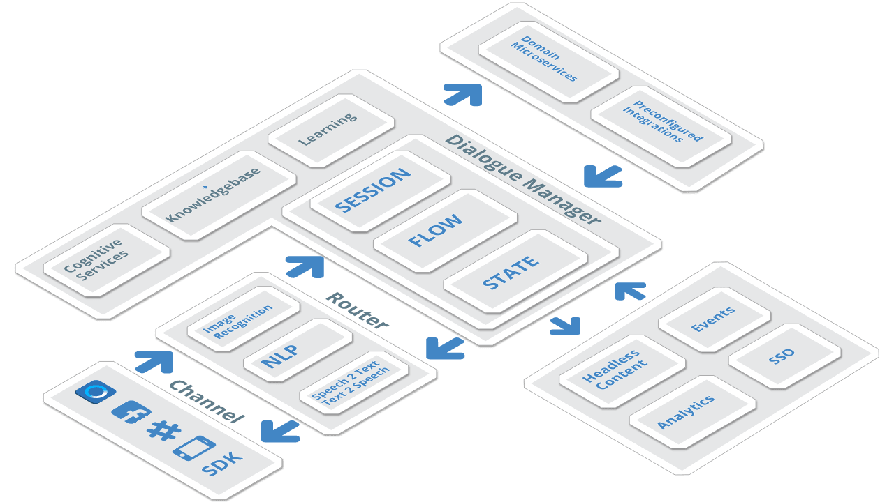

# mandrake.ai - Open source chatbot platform

## Introduction

Mandrake.ai is a development platform to build chatbots. The platform enables building dialogue flow visually and allows integration with a range of APIs and cognitive services out of the box. Mandrake.ai powered by **[node-red](https://github.com/node-red/node-red)**, open source visual programming tool and **[RASA NLU](https://github.com/RasaHQ/rasa_nlu)**, open source NLU framework.

## Why mandrake.ai?

Few questions below inspired inception of mandrake.ai

- How do we easily design a conversational experience while keeping the platform completely configurable and programmable?
- How can we build components which can be consumed independently by open source community without creating a dependency on the overall platform?

## Introduction to Chatbots

The following [article](https://www.linkedin.com/pulse/soon-we-have-bot-everything-siddhartha-lahiri) introduces key conceepts of Chatbots.

## Key features
- 

### mandrake-flow
### mandrake-nlp
### mandrake-connector

## Contribution Guidelines

## Code of conduct
(docs/CONTRIBUTING.md)[CONtributing]

# License
MIT
